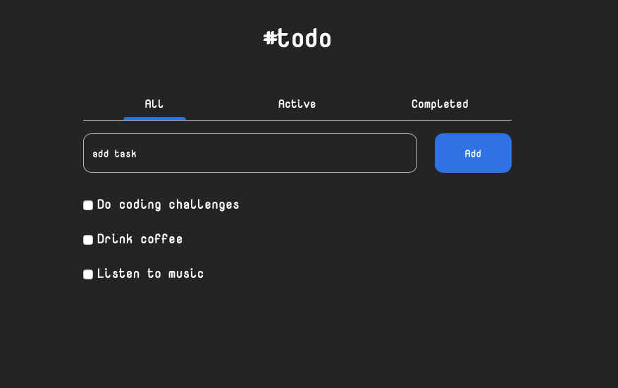

# Todo app

Il s'agit là d'une `application todo liste`. C'est un challenge <a href = "https://devchallenges.io/challenges/hH6PbOHBdPm6otzw2De5">`challenge`</a> de `devchallenge.io`.

## Fonctionnalités
* Ajouter une tâche
* Marquer une tâche comme accomplie
* Supprimer une tâche accomplie
* Avoir un button pour supprimer tous les tâches accomplies, bouton qui apparait lorsque cette liste contient plus d’un élément

## Développement

Ce projet est réalisé avec `HTML`, `CSS`, `JavaScript` et `React`, avec les dépendences `react`, `react-dom` et `uuid`.

## Démonstration

Vous pouvez visiter en cliquant sur l'image ci-dessous ou sur le lien en bas de la section `About`.

`Design de base récupéré chez devchallenge.io, adapté à mes goûts par mes soins !`
<a href = "https://yousoumar.github.io/todo/"></img></a>

