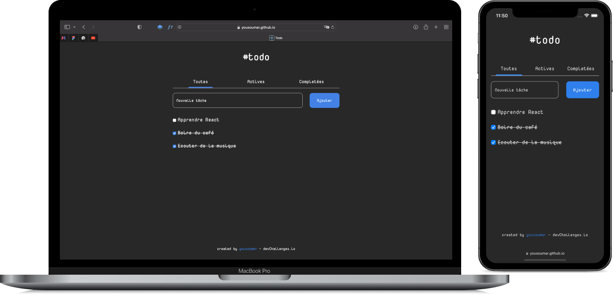

## todo app

Ce projet est codé avec `React`, avec les dépendences `react`, `react-dom` et `uuid`. J’utilise le `stockage local` pour garder la liste de tâches même après la fermeture de l’application. Elle permet de :

* Ajouter une tâche ;
* Marquer une tâche comme accomplie ;
* Supprimer une tâche accomplie ;
* Avoir un button pour supprimer toutes les tâches accomplies.

Vous pouvez visiter en cliquant sur l'image ci-dessous ou sur le lien en bas de la section `About`.

`Design de base récupéré chez devchallenge.io, adapté à mes goûts par mes soins !`

<a href = "https://yousoumar.github.io/todo/"></img></a>

