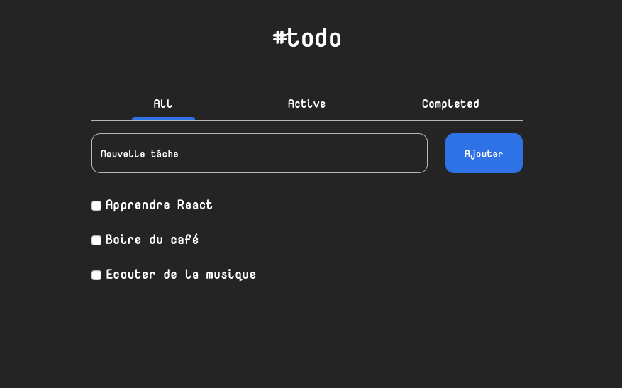

# #todo

Il s'agit là d'une `todo liste`, mais pas que ! Il faudrait visiter pour savoir, elle est réalisée avec beaucoup d'amour.😁

## Fonctionnalités
* Ajouter une tâche
* Marquer une tâche comme accomplie
* Supprimer une tâche accomplie
* Avoir un button pour supprimer toutes les tâches accomplies, bouton qui apparait lorsque cette liste contient plus d’un élément

## Développement

Ce projet est réalisé en `HTML`, `CSS`, `JavaScript` et `React`, avec les dépendences `react`, `react-dom` et `uuid`.

Note : J’utilise le `stockage local` pour garder la liste de tâches même après la fermeture de l’application.

## Démonstration

Vous pouvez visiter en cliquant sur l'image ci-dessous ou sur le lien en bas de la section `About`.

`Design de base récupéré chez devchallenge.io, adapté à mes goûts par mes soins !`

<a href = "https://yousoumar.github.io/todo/"></img></a>

